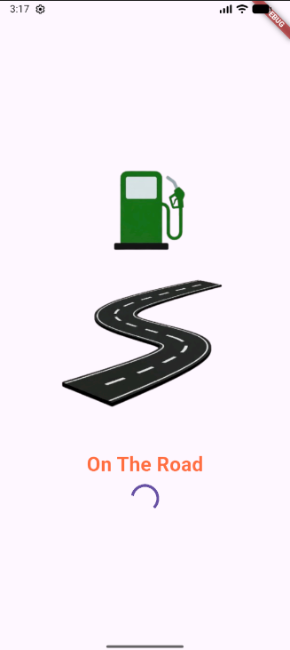

On The Road: Fuel Cost Estimator

This app is used to calculate the estimated cost of your trip based on distance, fuel efficiency of the car, and fuel price.

Process:

1) The user inputs distance (miles or km), efficiency (km/l or mile/l), and price (RM/L).
2) Verify that the input is numerical and greater than 0, then calculate the cost using the formula distance/efficiency * price.
3) Display the cost as text below the calculate button. 

Widgets:

1-AppBar

2-Center

3-SingleChildScrollView

4-SizedBox

5-Column

6-Row

7-Padding

8-TextField

9-InputDecoration

10-DropdownButton

11-Text

12-ElevatedButton

13-Container

Validation: The application was tested with multiple input combinations, eg.

1) all missing
2) Only the distance is input correctly
3) Price and distance are entered correctly
4) Efficiency is entered as 0
5) All values are entered correctly
   
Additionally, I used the Fuel Cost Calculator online to confirm that results and unit conversion were calculated correctly.

Authorship Note with signature:

Hazem Ahmed Elsayed Ahmed Aboud (297225)

“I confirm that this project represents my own original work in accordance with academic integrity policies. No part of the code was fully generated by AI tools such as ChatGPT or GitHub Copilot. I relied solely on lecture notes, class tutorials, and official Flutter documentation. I understand that my work may be scrutinized, and if it is found that I did not personally develop the code, marks may be deducted, or the submission may be disqualified.”
Screenshots: Splash Screen:

Screenshots: Splash Screen:

Home Page without input:

Example of error handling:

Output:

